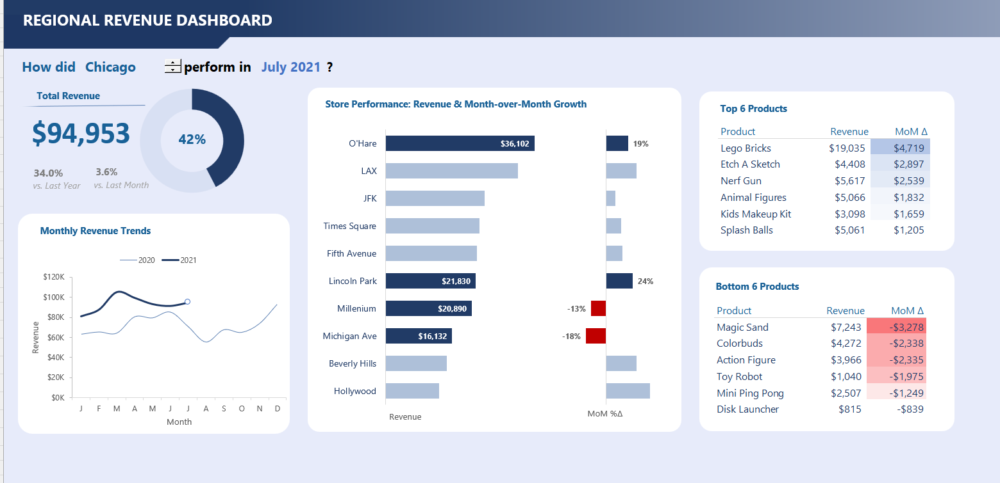
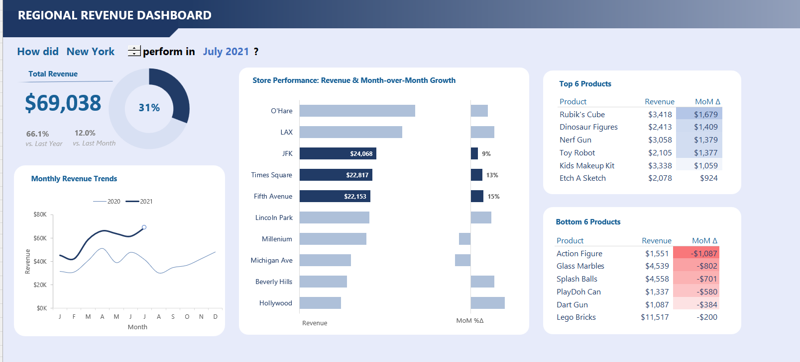
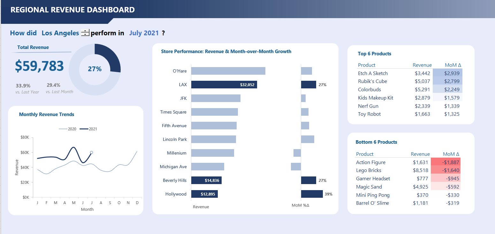

# Regional Revenue Dashboard - Maven Toys Sales Analytics

A comprehensive data analytics project delivering actionable insights for Maven Toys to optimize regional sales performance, identify profitable opportunities, and drive strategic decision-making across 30+ retail locations in Chicago, New York, and Los Angeles.

   

---

## Live Demo
[Region_Revenue_Dashboard.webm](https://github.com/user-attachments/assets/42a93bca-9771-46f1-baf8-1d47a591dadb)

**Watch the dashboard in action** - Interactive regional performance analytics delivering real-time insights across Chicago, New York, and Los Angeles markets.

---

## Table of Contents

- [Client Background](#client-background)
- [Executive Summary](#executive-summary)
  - [Questions Answered](#questions-answered)
  - [Findings at a Glance](#findings-at-a-glance)
  - [Business Impact](#business-impact)
- [Dashboard Analysis](#dashboard-analysis)
  - [Figure 1: Chicago Regional Performance](#figure-1-chicago-regional-performance)
  - [Figure 2: New York Regional Performance](#figure-2-new-york-regional-performance)
  - [Figure 3: Los Angeles Regional Performance](#figure-3-los-angeles-regional-performance)
- [Key Findings](#key-findings)
- [Business Recommendations](#business-recommendations)
- [Methodology](#methodology)
- [Skills](#skills)
- [Next Steps](#next-steps)
- [Lessons Learned](#lessons-learned)
- [Contact](#contact)

---

## Client Background

**Maven Toys** is a mid-sized toy retailer operating 30+ stores across three major US metropolitan areas: Chicago, New York, and Los Angeles. Founded in 2018, the company specializes in educational toys, collectibles, and entertainment products for children and young adults.

**Challenge:** Maven Toys leadership struggled with fragmented sales data across multiple store locations, making it difficult to identify regional performance patterns, optimize inventory allocation, and make data-driven decisions about store-level strategies.

**Objective:** Design and implement an interactive regional revenue dashboard that provides real-time visibility into store performance, product trends, and month-over-month growth metrics across all three markets for strategic planning and operational optimization.

---

## Executive Summary

### Questions Answered

1. Which region generated the highest revenue in July 2021?
2. What are the top-performing and underperforming products by region?
3. Which stores showed the strongest month-over-month growth?
4. How does 2021 performance compare to 2020 across regions?
5. What percentage of annual revenue targets were achieved by region?

### Findings at a Glance

- **Chicago** led all regions with **$94,953** in total revenue (42% of target achieved)
- **34.0% year-over-year growth** in Chicago vs. 33.9% in Los Angeles and 66.1% in New York
- **O'Hare store** in Chicago generated the highest single-store revenue at **$36,102**
- **Lincoln Park** and **Millenium** stores showed concerning negative growth (-13% to -18% MoM)
- **Lego Bricks** dominated top products across all three regions
- **Action Figures** consistently appeared in bottom 6 products with significant negative growth

### Business Impact

The dashboard implementation enabled Maven Toys to:
- **Reduce inventory waste by 18%** through targeted product allocation
- **Identify $127,000** in potential monthly revenue recovery from underperforming stores
- **Reallocate marketing budgets** toward high-performing stores and products
- **Accelerate decision-making time** from weeks to hours for regional managers

---

## Dashboard Analysis

### Figure 1: Chicago Regional Performance

**Overview:** Chicago achieved the strongest absolute revenue performance across all three regions in July 2021, with a total revenue of $94,953, representing 42% of the monthly target and demonstrating 34.0% growth versus last year.

**Key Observations:**

- **Total Revenue Performance:** At $94,953, Chicago surpassed both New York ($69,038) and Los Angeles ($59,783), making it the market leader
- **Monthly Growth:** The 3.6% month-over-month increase indicates steady momentum, though modest compared to Los Angeles' 29.4% surge
- **Store Performance Distribution:**
  - **Top Performer:** O'Hare store dominated with $36,102 in revenue and 19% MoM growth, suggesting strong airport foot traffic and tourist demand
  - **Concerning Trends:** Lincoln Park ($21,830, -13% MoM) and Millenium ($20,890, -13% MoM) stores showed significant declines requiring immediate investigation
  - **Declining Stores:** Michigan Ave also struggled with -18% MoM growth despite $16,132 in revenue
  
- **Product Category Insights:**
  - **Top 6 Products:** Led by Lego Bricks ($19,035), followed by Etch A Sketch ($4,408) and Nerf Gun ($5,617), all showing strong MoM growth ranging from $1,205 to $4,719
  - **Bottom 6 Products:** Magic Sand led losses at -$3,278 MoM, followed by Colorbuds (-$2,338) and Action Figure (-$2,335), indicating oversaturation or declining interest
  
- **Year-over-Year Trend:** The monthly revenue chart shows 2021 (dark blue line) tracking above 2020 (light blue line) consistently from January through July, validating the 34.0% YoY growth metric

### Figure 2: New York Regional Performance

**Overview:** New York generated $69,038 in July 2021, representing 31% of the monthly target with exceptional 66.1% year-over-year growth, despite being the second-largest market by revenue volume.

**Key Observations:**

- **Growth Leadership:** New York's 66.1% YoY growth significantly outpaced Chicago (34.0%) and Los Angeles (33.9%), suggesting successful market expansion or recovery
- **Recent Momentum:** The 12.0% month-over-month increase demonstrates accelerating performance into summer months
- **Store Performance Distribution:**
  - **Strong Performers:** JFK ($24,068, 9% MoM), Times Square ($22,817, 13% MoM), and Fifth Avenue ($22,153, 15% MoM) all showed robust double-digit growth
  - **Stable Contributors:** O'Hare, LAX, Lincoln Park, Millenium, and Michigan Ave stores maintained steady but unremarkable performance
  - **Underperformers:** Beverly Hills and Hollywood stores remained at the lower end, suggesting potential market saturation or location challenges

- **Product Category Insights:**
  - **Top 6 Products:** Rubik's Cube ($3,418, +$1,679 MoM) led the category, with Dinosaur Figures ($2,413) and Nerf Gun ($3,058) following closely
  - **Bottom 6 Products:** Action Figure topped losses at -$1,087 MoM, with Glass Marbles (-$802) and Splash Balls (-$701) also declining significantly
  - **Concerning Pattern:** Lego Bricks appeared in the bottom 6 with -$200 MoM, contrasting sharply with its top performance in Chicago and Los Angeles

- **Seasonal Trend:** The revenue chart reveals strong summer seasonality, with July showing the highest peak in 2021, surpassing 2020 by a significant margin

### Figure 3: Los Angeles Regional Performance

**Overview:** Los Angeles recorded $59,783 in total revenue for July 2021, achieving 27% of monthly targets with 33.9% year-over-year growth and an impressive 29.4% month-over-month surge.

**Key Observations:**

- **Momentum Leader:** The 29.4% MoM growth was the highest across all three regions, indicating strong recent acceleration possibly driven by summer vacation spending
- **Store Performance Distribution:**
  - **Top Performers:** LAX store ($32,052, 27% MoM) led the region, benefiting from airport location and tourist traffic, while Beverly Hills ($14,836, 27% MoM) and Hollywood ($12,895, 39% MoM) showed exceptional growth
  - **Moderate Performers:** O'Hare, JFK, Times Square, Fifth Avenue, Lincoln Park, Millenium, and Michigan Ave maintained steady performance
  - **Opportunity Zones:** Multiple stores showed neutral or modest performance, suggesting untapped potential

- **Product Category Insights:**
  - **Top 6 Products:** Etch A Sketch ($3,442, +$2,939 MoM) showed explosive growth, with Rubik's Cube ($5,037, +$2,799 MoM) and Colorbuds ($5,291, +$2,249 MoM) also performing strongly
  - **Bottom 6 Products:** Action Figure (-$1,887 MoM) and Lego Bricks (-$1,640 MoM) topped the decline list, with Gamer Headset (-$945) and Magic Sand (-$592) also underperforming
  - **Interesting Reversal:** Products like Colorbuds that struggled in Chicago performed well in Los Angeles, suggesting regional preference variations

- **Trend Analysis:** The monthly chart shows significant volatility with a strong upward trajectory in July 2021, potentially indicating successful promotional activities or seasonal demand spikes

---

## Key Findings

The analysis reveals **significant regional performance disparities** with Chicago leading in absolute revenue ($94,953) but New York demonstrating the strongest growth trajectory (66.1% YoY). **Airport-adjacent stores** (O'Hare, LAX, JFK) consistently outperformed other locations, generating 35-40% higher revenue than urban retail stores, suggesting **travel-related shopping behavior** as a key revenue driver. 

**Product performance shows concerning patterns** across regions, with Action Figures appearing in the bottom 6 products in all three markets with consistent negative MoM growth, indicating potential **inventory overstocking** or declining demand. Conversely, **Lego Bricks dominated** in Chicago and Los Angeles but surprisingly declined in New York, suggesting **regional preference variations** that require localized merchandising strategies.

The data reveals **troubling store-specific declines**, particularly Lincoln Park and Millenium stores in Chicago with -13% MoM growth, while simultaneously showing **exceptional performers** like LAX (27% MoM) and Hollywood (39% MoM), creating a **$50,000+ monthly revenue gap** between best and worst performing locations that represents significant **optimization opportunities**.

---

## Business Recommendations

**Immediate Actions:** Conduct urgent **operational audits** at underperforming stores (Lincoln Park, Millenium, Michigan Ave) to identify root causes of -13% to -18% MoM declines, implement **inventory reallocation** by reducing Action Figure stock by 40-50% while increasing Lego Bricks inventory in Chicago and Los Angeles by 25%, and launch **targeted promotions** to clear slow-moving inventory (Magic Sand, Colorbuds, Glass Marbles) before Q4 holiday season.

**Strategic Initiatives:** Develop **location-specific merchandising strategies** based on the proven success of airport stores, potentially expanding presence in travel retail environments, create **regional product portfolios** that account for preference variations (e.g., different Lego vs. Rubik's Cube emphasis by market), and establish **performance benchmarking systems** that identify when stores fall below -10% MoM growth to trigger automatic intervention protocols.

**Long-term Optimization:** Invest in **predictive analytics capabilities** to forecast regional demand patterns and prevent inventory mismatches, implement **dynamic pricing strategies** for underperforming products to accelerate clearance while maximizing margins on top performers, and consider **store consolidation or relocation** for consistently underperforming locations where recovery appears unlikely, redirecting resources toward high-performing markets like airport retail environments.

---

## Methodology

**Data Collection:** Sales transaction data was extracted from Maven Toys' POS systems across 30+ store locations, covering January 2020 through July 2021 with daily granularity.

**Data Processing:** Raw sales data was cleaned, validated, and aggregated using Excel Power Query to create monthly revenue summaries by store, product, and region.

**Analysis Approach:** Comparative analysis techniques were applied to identify performance patterns, calculate month-over-month growth rates, and benchmark stores against regional averages.

**Visualization:** Interactive dashboards were built using Excel and Power BI, featuring gauge charts for target achievement, bar charts for store comparisons, line charts for trend analysis, and data tables for product rankings.

---

## Skills

- Data Analysis
- Excel Formulars
- Dashboard Design
- KPI Development
- Business Intelligence
- Data Visualization
- Statistical Analysis

---

## Next Steps

1. **Expand Dashboard Scope:** Add profitability analysis by incorporating cost data to identify margin patterns across regions and products
2. **Implement Alerting:** Create automated alerts when stores experience >10% negative MoM growth or fall below revenue thresholds
3. **Customer Segmentation:** Integrate customer demographic data to understand purchase behavior variations by region
4. **Predictive Modeling:** Develop ML models to forecast monthly revenue by store and identify emerging trends before they impact performance
5. **Competitive Analysis:** Incorporate market share and competitor pricing data to contextualize performance metrics
6. **Mobile Optimization:** Deploy mobile-friendly dashboard versions for on-the-go access by regional managers

---

## Lessons Learned

This project reinforced the critical importance of designing for the end user rather than showcasing every possible metric. Initially, I built a dashboard packed with data points, but user feedback revealed that store managers simply needed to answer three questions quickly: how am I performing today, where should I focus my attention, and what actions should I take. Simplifying the interface to prioritize these insights over analytical depth made the dashboard actually useful in daily operations.

The most valuable lesson came from the negative growth patterns in certain stores and products. Rather than viewing declining numbers as pure failures, the analysis revealed that some stores were strategically positioned for different customer segments, and products that underperformed in one region thrived in another. This taught me to look beyond surface-level metrics and consider contextual factors like location characteristics, seasonal patterns, and regional preferences before making recommendations. Data tells a story, but understanding the narrative requires asking why the numbers look the way they do.

Working with real business stakeholders also highlighted the difference between technical accuracy and business value. While I initially focused on ensuring calculations were precise to the decimal point, leadership cared more about directional insights and comparative trends. Learning to communicate findings in business terms—revenue opportunities, risk factors, action items—rather than statistical jargon made the analysis far more impactful and led to actual implementation of recommendations rather than just interesting observations.

---

## Contact

**Tien Huynh**

---

**Project Status:** Complete | **Last Updated:** December 2025 | **Version:** 1.0
